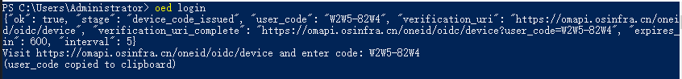
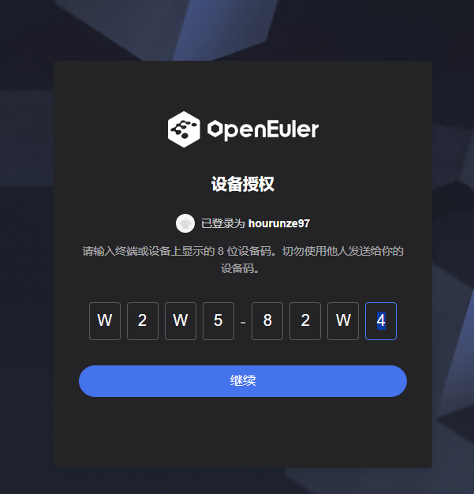
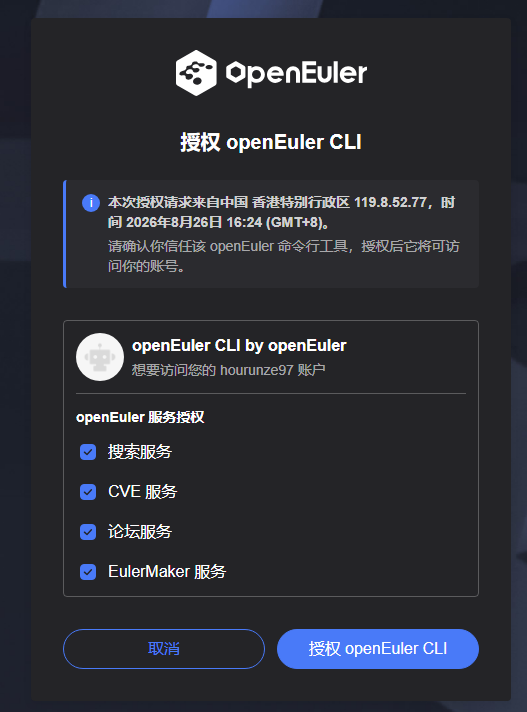
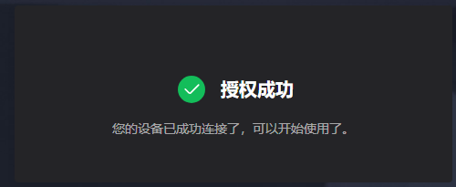

# oed-cli

> **oed** — one CLI for openEuler community services. Auto-discovered, JSON-first, AI-friendly. Built for humans and LLM agents.

[](https://www.python.org) [](https://gitcode.com/openeuler/oed-cli/tree/master/LICENSE) [](https://pypi.org/project/oed-cli/)

`oed` doesn't ship a static list of commands. It reads the openEuler Infra Discovery Service at runtime and builds its entire command surface dynamically. When a new service ships, `oed` picks it up automatically — no upgrade required.

## Why oed?

`oed` exists to solve one specific problem: a CLI that talks to _many evolving services_ without multiplying that complexity. Shipping a hand-written client per service per version is exactly the versioning pressure that the Zylos API versioning research warns against — and for AI agent consumers that pressure is acute: a renamed field silently breaks a tool call, a new required parameter crashes an otherwise healthy workflow. `oed` sidesteps the whole problem by being one client that **discovers every service at runtime**, so the only thing that has to be versioned is the gateway's OpenAPI spec itself.

- **Zero boilerplate.** No copy-pasted OpenAPI clients, no per-service SDKs, no `--data` to escape, no `User-Agent` headers to remember.
- **Runtime discovery.** The `oed cve --help` list you saw above is built from `https://api-gateway.osinfra.cn/discovery/apis` on every call. New services, new endpoints, and new schema fields show up without an `oed` upgrade. A 10-minute cache keeps CI bursts cheap; `oed cache refresh` forces an immediate re-fetch when you know the gateway just shipped.
- **AI-friendly output.** Single JSON object on stdout, deterministic exit codes (`0` success · `1` user · `2` network · `3` upstream · `4` not found). Logs and progress go to stderr so `| jq` is always safe.
- **Claude / Cursor ready.** Ships with `.claude/skills/oed-cli/SKILL.md` so agents know how to use it without a custom prompt.

## Install

```
pip install oed-cli
```

Or in an isolated environment (recommended for CI):

```
pipx install oed-cli
```

From source:

```
git clone https://gitcode.com/openeuler/oed-cli && cd oed-cli
pip install -e .
```

Verify:

```
oed --version       # → oed, version 0.3.0
```

## Quick start: install, then call

```
pip install oed-cli
oed cve getSecurityNoticeByCveId --cve-id CVE-2019-10082
```

### (optional) Call an AtomGit operation — store a token once

Operations on the `ag` (AtomGit) service authenticate via an `access_token` query parameter. Store a personal access token once, and every `oed ag ...` call injects it automatically:

```
oed ag login
```

Then `oed ag listAuthenticatedUserIssues` just works — no per-call token flag needed. Full details (`oed ag login --token <pat> [--no-verify]`, `--status`, `oed ag logout`, how the token is stored, auto-injection rules) are in the AtomGit (`ag`) authentication section below.

That's it. `oed` discovers the service from the gateway, pulls its OpenAPI spec, derives `--cve-id` from the declared `query` parameter, fills WAF-safe browser headers, and ships the request through the production gateway:

```
{
  "ok": true,
  "status": 200,
  "url": "https://apig.osinfra.cn/cve-security-notice-server/securitynotice/getByCveId",
  "response": {
    "code": 0,
    "result": [
      {
        "cveId": "CVE-2019-10082",
        "affectedProduct": "openEuler-20.03-LTS",
        "affectedComponent": "httpd-2.4.34-18",
        "announcementTime": "2020-05-13",
        ...
      }
    ]
  }
}
```

Output is plain JSON on stdout — pipe straight into `jq`:

```
oed cve getSecurityNoticeByCveId --cve-id CVE-2019-10082 \
  | jq '.response.result[0] | {cveId, affectedProduct, affectedComponent}'
```

```
{
  "cveId": "CVE-2019-10082",
  "affectedProduct": "openEuler-20.03-LTS",
  "affectedComponent": "httpd-2.4.34-18"
}
```

### Want to look around first? (optional)

```
oed info      # gateway snapshot: services_total, cache status, community
oed services  # full service list — pick one to call next
oed <service> --help                       # list that service's operations
oed <service> <operation> --help           # see every flag for one operation
oed <service> <operation> --dry-run --…    # preview the request, no network
```

The first `oed <service> <operation>` call after install will pull a fresh discovery feed + that service's OpenAPI spec; subsequent calls within 10 minutes reuse the local cache. Run `oed cache refresh` to force a re-fetch when you know the gateway just shipped something new.

## "What flags does this operation take?" → `--help`

Don't guess. Each operation auto-derives its own flags from the OpenAPI schema:

```
oed cve getSecurityNoticeByCveId --help
```

```
{
  "help_for": "getSecurityNoticeByCveId",
  "operation_id_raw": "getSecurityNoticeByCveId",
  "method": "GET",
  "path": "/cve-security-notice-server/securitynotice/getByCveId",
  "url": "https://apig.osinfra.cn/cve-security-notice-server/securitynotice/getByCveId",
  "parameters": [
    {
      "name": "cveId",
      "in": "query",
      "required": true,
      "flag": "--cve-id",
      "alt_flag": "--cveId",
      "type": "string",
      "description": "CVE ID"
    }
  ],
  "usage": "oed <service> getSecurityNoticeByCveId --cve-id <value> [--dry-run]"
}
```

Same idea at the service level — list every operation with one flag each:

```
oed cve --help | jq '.operations | length'
# → 37
```

## More examples

```
# Dry-run — preview the request without hitting the network
oed cve getSecurityNoticeByCveId --cve-id CVE-2019-10082 --dry-run

# Date-filtered query — pagination comes back as total/page/size
oed meeting listMeetings --date 2026-07-29
# → response.data: [ { "topic": "安全sig例会", "group_name": "security-committee",
#                     "date": "2026-07-29", "start": "16:00", "end": "18:00",
#                     "join_url": "https://meeting.huaweicloud.com:36443/#/j/985661561", ... } ]

# Forum — Discourse `/latest.json`;
oed forum listLatestTopics --per-page 2
# → response.topic_list.topics: [ { "title": "《openEuler社区论坛使用指南&规则》",
#                                   "posts_count": 12, "created_at": "2023-01-16T07:53:30.163Z" }, ... ]

# Search — POST JSON body; `keyword` + `lang` are required, pageSize must be 6-49
oed search multisearchDocByKeyword \
  --json '{"keyword":"软件源安装速度慢怎么办","lang":"zh","page":1,"pageSize":10}'
# → response.obj.records: [ { "title": "<span>软件下载慢问题</span>",
#                             "path": "https://eur.openeuler.openatom.cn/coprs/",
#                             "type": "service", "lang": "zh" }, ... ]
```

## oneid login (RFC 8628 device flow)

Most services behind the openEuler gateway (eulermaker, pkgcontrib, meeting, …) require a **user identity** — not an AtomGit PAT, but your openEuler oneid account. `oed login` obtains it via the [RFC 8628 Device Authorization Grant](https://datatracker.ietf.org/doc/html/rfc8628): no local HTTP server, no `redirect_uri`, no `client_secret`, no port to open on a firewall. It works identically on a laptop, over SSH, and in a container.

### Log in

```
oed login
```

`oed` asks openEuler oneid for a device code and prints both the **user code** and the **verification URL** to stderr:

```
Open https://omapi.osinfra.cn/oneid/oidc/device in a browser.
Enter the user code: 98R4-GGKW
Waiting for approval...
```





Open the URL in **any** browser — the one on this machine, a phone, or a laptop connected to a remote host over SSH — enter the user code, and approve the request with your openEuler account. `oed` polls oneid in the background and, once you approve, stores the resulting `access_token` + `refresh_token` automatically. You never paste a token into the terminal.

`oed login` is a top-level shortcut for `oed auth login`; both names stay valid and run the same device flow.

### Where the token lives

After a successful login, the token is written to your **OS-native credential store** when one is reachable — macOS Keychain, Windows DPAPI / Credential Manager, Linux SecretService (libsecret). When no keystore is reachable (headless Linux, CI, locked GNOME Keyring), `oed` silently falls back to `<OED_CACHE_DIR>/auth.json` with `0600` perms on POSIX; no user action is required.

| Platform               | Backend                                         |
| ---------------------- | ----------------------------------------------- |
| macOS                  | Keychain (encrypted)                            |
| Windows                | DPAPI / Credential Manager (encrypted)          |
| Linux desktop          | SecretService / libsecret (encrypted)           |
| Linux headless / CI    | `auth.json` 0600 plaintext fallback             |

> **Why `oed auth status` says `plaintext` on Windows / Linux out of the box** — Python's `keyring` library ships per-platform backends as *optional* extras (so it stays installable on minimal systems). `oed-cli` only depends on `keyring>=24`; for the Windows DPAPI / Linux SecretService backend you also need to install one of:
>
> ```
> pip install "oed-cli[os-keyring-windows]"   # Windows DPAPI / Credential Manager
> pip install "oed-cli[os-keyring-linux]"     # Linux SecretService (libsecret)
> pip install "oed-cli[os-keyring]"           # both
> ```
>
> Without the matching backend, `oed` silently uses the 0600 plaintext fallback — nothing is broken, the `backend` field in `oed auth status` will read `"plaintext"`.

Inspect the active backend any time with `oed auth status` — the JSON includes a `"backend"` field (`"keyring"` or `"plaintext"`). When keyring is in use, no `auth.json` is written to disk.

Once logged in, every subsequent `oed <service> <operation>` call sends the token as `Authorization: Bearer <token>` automatically — no per-call flag. A `401` from the upstream surfaces as an `UpstreamError(kind="unauthorized")` with a hint pointing at `oed auth status`.

### Headless / SSH / CI login

On a headless host (no `DISPLAY` / `WAYLAND_DISPLAY`) `oed login` still works — it prints the URL + user code to stderr and keeps polling. You approve from **any** browser elsewhere; the CLI picks up the token when the approval lands. No browser needs to run on the server.

To skip the auto-open-the-browser attempt entirely (CI / containers), set:

```
BROWSER=none oed login
```

> **Tip** — don't re-run `oed login` while a code is pending. A new run requests a **new** device code and overwrites the one you may already be approving in the browser. If the first code expired, just wait — oneid invalidates it and `oed login` will tell you to start fresh.

### Other auth commands

```
oed auth status                  # is a token loaded? (token is redacted as first3...last2; shows backend + allowlist)
oed login --manual               # paste a token from a TTY (rejected in non-TTY contexts)
oed auth token <bearer> [--cookie "k=v"]   # write a token directly — preferred for agents / CI / piped scripts
oed auth logout                  # clear the stored token
```

Runtime precedence: `OED_TOKEN` env wins over the stored token; `OED_COOKIE` does the same for the optional `Cookie` header.

### Per-user service allow-list

When you log in via `oed login` (device flow), oneid returns the list of services you've authorized for this CLI. `oed` stores it locally in `auth.json.allowlist` and uses it to gate subsequent `oed <service> ...` invocations — services not on the list are rejected with `kind="service_blocked_by_allowlist"` (exit 1). Update your allow-list in the oneid UI, then re-run `oed login` to refresh the local copy.

The check is **fail-open** when `auth.json` is missing, has no `allowlist` field (legacy compat), or the list is `[]` (you explicitly cleared it in oneid). Reserved commands (`auth`, `services`, `info`, `schema`, `cache`, `--help`, `--version`) bypass the gate entirely. `oed auth status` shows the current list.

## AtomGit (`ag`) authentication

AtomGit operations authenticate through the `access_token` query parameter declared on their spec. Store a personal access token once, and every `oed ag ...` call uses it automatically:

```
# Interactive (prompts for the token, never echoes it back)
oed ag login

# Non-interactive — good for CI / scripts
oed ag login --token <pat>

# Skip validating the token against AtomGit before storing
oed ag login --token <pat> --no-verify

# Just report whether a token is configured (no network, no prompt)
oed ag login --status

# Forget the stored token
oed ag logout
```

Token storage:

- Same keyring-backed store as `oed login`: macOS Keychain / Windows DPAPI / Linux SecretService when an OS keystore is reachable, otherwise a 0600 plaintext fallback file.
- Lives under a `tokens/` subdir of the cache dir (`tokens/ag.json` when keyring is unavailable); `oed cache clear` never touches credentials.
- Stored under a separate keyring entry (`ag:ag`) from the `oed login` oneid token, so the two credentials never collide.

Auto-injection on real calls:

- If the operation declares `access_token` and you don't pass one, the stored token is filled in automatically — `oed ag listAuthenticatedUserIssues` just works.
- An explicit `--access-token <pat>` always wins over the stored one.
- If the operation requires a token and none is available anywhere, you get a clear `ag_token_missing` error with a hint, instead of an opaque gateway 401.
- `--dry-run` and request echo views mask the token as `<stored>` — the real value only ever goes out on the wire.

## Local development

### Clone and install (editable)

```
git clone https://gitcode.com/openeuler/oed-cli && cd oed-cli
pip install -e ".[dev]"
```

`pip install -e .` makes source edits take effect on the next `oed` invocation. Drop it with `pip uninstall oed-cli` when you're done.

### Run the tests (~0.3 s, fully offline)

```
python -m pytest -q
```

58 tests cover v0.1 + v0.2 dispatch, the operation-help cheatsheet, per-parameter flag coercion, the `API_`-prefix alias, the `resolve_runtime_gateway` no-fallback semantics, every exit code path, and v0.4's `ag` token store (DPAPI/base64) + auto-injection. They monkeypatch the discovery layer so no gateway access is needed.

### Smoke-test against the live gateway

```
# 1) Health check
oed info
# → {"ok": true, "services_total": 8, "community": "openeuler", ...}

# 2) Real CVE query (canonical end-to-end test)
oed cve getSecurityNoticeByCveId --cve-id CVE-2019-10082

# 3) Dry-run to inspect URL + body without hitting the network
oed cve getSecurityNoticeByCveId --cve-id 1 --dry-run

# 4) Verify the canonical URL routing
oed cve getSecurityNoticeByCveId --dry-run --cve-id 1 \
  | jq '.url'
# → "https://apig.osinfra.cn/cve-security-notice-server/securitynotice/getByCveId"
```

### Cache debugging

```
oed cache show      # path, size, age, TTL
oed cache refresh   # force re-fetch the discovery feed
oed cache clear     # delete the cache file
```

Cache lives at `~/.cache/oed-cli/` (XDG) or `C:\Users\<you>\AppData\Local\oed-cli\cache\` on Windows. Override with `OED_CACHE_DIR=...`. Per-service OpenAPI specs are cached next to it under `specs/<community>/<service>.json` with the same 10-minute TTL. The auth file (`auth.json`) and the exchange endpoint's bundled OAuth client credentials are also rooted under the same `OED_CACHE_DIR`.

### Keeping in sync with the gateway

`oed` does **not** warm up a fresh discovery feed on every invocation — only the first command in a 10-minute window actually hits the gateway, the rest read from `~/.cache/oed-cli/discovery.json`. That keeps CI scripts that run dozens of `oed` calls from hammering the gateway, and it means `oed --help` and `oed --version` never touch the network.

When the gateway adds a new service or operation, refresh the cache by hand:

```
# Fastest: drop the 10-minute TTL and re-pull the discovery feed
oed cache refresh

# Or, nuke and re-fetch from a known-clean state
oed cache clear && oed info

# Then confirm the new service is now visible
oed services | jq -r '.[] | .service_name'
```

The first call to a brand-new service will additionally pull its OpenAPI spec into `specs/<community>/<service>.json` (also 10-minute TTL); after that it's reused like any other spec.

**Why this isn't automatic.** openEuler Infra services are added on a weekly-to-quarterly cadence via review, not minute-to-minute. Auto-refreshing on every `oed` invocation would burn a network round-trip per CLI call for no practical benefit. The TTL exists to absorb CI bursts, not to delay visibility of new endpoints.

**Future** — `oed whatsnew` (planned) will diff the freshly-pulled feed against the previous cache and print only what changed, so you don't have to eyeball `oed services` output every week.

**Cache integrity.** The local cache is plain JSON and lives in a user-writable directory, so a malicious same-user process can in principle rewrite it. `oed` applies three defenses (issue #22): (1) a cached timestamp more than ~5 min in the future is treated as poisoned and discarded — this closes the "set the timestamp ahead so the entry never expires" trick; (2) a runtime `base_url` whose scheme is anything other than `https` (e.g. a poisoned `http://evil.com`) is hard-rejected before any credentials are attached, so a tampered host can't exfiltrate your Bearer token / `ag` PAT over plaintext; (3) cache writes are atomic (tmp + replace) so a crash mid-write can't leave a corrupt file. If you ever see `insecure_base_url`, run `oed cache clear` and retry. Note this is defense-in-depth — a same-user process that can write the cache can typically also read your keyring directly.

### Common errors

| Symptom | Cause | Fix |
| --- | --- | --- |
| `ModuleNotFoundError: oed_cli` | not installed in env | `pip install -e .` |
| `oed info` hangs or `waf_block` exit 2 | gateway unreachable / WAF | confirm `curl https://api-gateway.osinfra.cn`; see `context/discoverAPI.md` §6 |
| Chinese output garbled on Windows | console codepage not UTF-8 | `chcp 65001`, or pipe `| python`, or `PYTHONIOENCODING=utf-8 oed …` |
| `error="spec_missing"` (exit 4) on a known service | upstream hasn't published the spec yet | wait for the gateway-side OpenAPI yaml; nothing to do on the oed side |
| `error="ag_token_missing"` on an `ag` call | operation needs a token, none stored | `oed ag login` (or pass `--access-token <pat>`) |
| `error="body_fields_via_params"` (exit 1) on a POST | body fields were passed via `--params` (which only covers query/path) | resend the fields with `--json '{...}'` — `oed <service> <op> --help` lists the body schema |
| `error="gateway_managed_param"` (exit 1) on a `forum` call | `Api-Key` / `Api-Username` were passed (`--api-key` or `--params`) | drop them — `oed` auto-fills both placeholder headers on every `forum` call and the gateway converts them |
| `error="service_blocked_by_allowlist"` (exit 1) | the service is not on your oneid allow-list | update your allow-list in oneid, then `oed login` to refresh the local copy |
| `error="unauthorized"` (exit 3) on an authenticated call | token missing / expired / wrong role | `oed auth status`; re-run `oed login` |
| A `cve` call exits 2 (`waf_block`) | spec points to a `.test.osinfra.cn` host | already handled — `oed` reads `base_url` from the discovery feed (no fallback) and ignores the spec's `x-apigateway-backend.httpEndpoints.address` for the host |

### Offline mode

`oed --help`, `oed info` (uses cached feed), `pytest`, and any command against a service whose spec is in the local cache all work without network. To run `oed` from source without installing:

```
python -m oed_cli --help
# or
python -c "from oed_cli.main import main; sys.argv = ['oed','--help']; main()"
```

## Documentation

- Design doc — architecture, command contract, exit codes, packaging, roadmap.
- Local testing guide — install, smoke test, every per-parameter flag demo.
- Discovery API reference — the data source `oed` consumes, plus WAF caveats.

## Contributing

Issues and patches welcome on [gitcode.com/openeuler/oed-cli](https://gitcode.com/openeuler/oed-cli).

Dev install:

```
pip install -e ".[dev]"
pytest
ruff check src tests
```

## License

Apache-2.0. See [LICENSE](https://gitcode.com/openeuler/oed-cli/tree/master/LICENSE).
