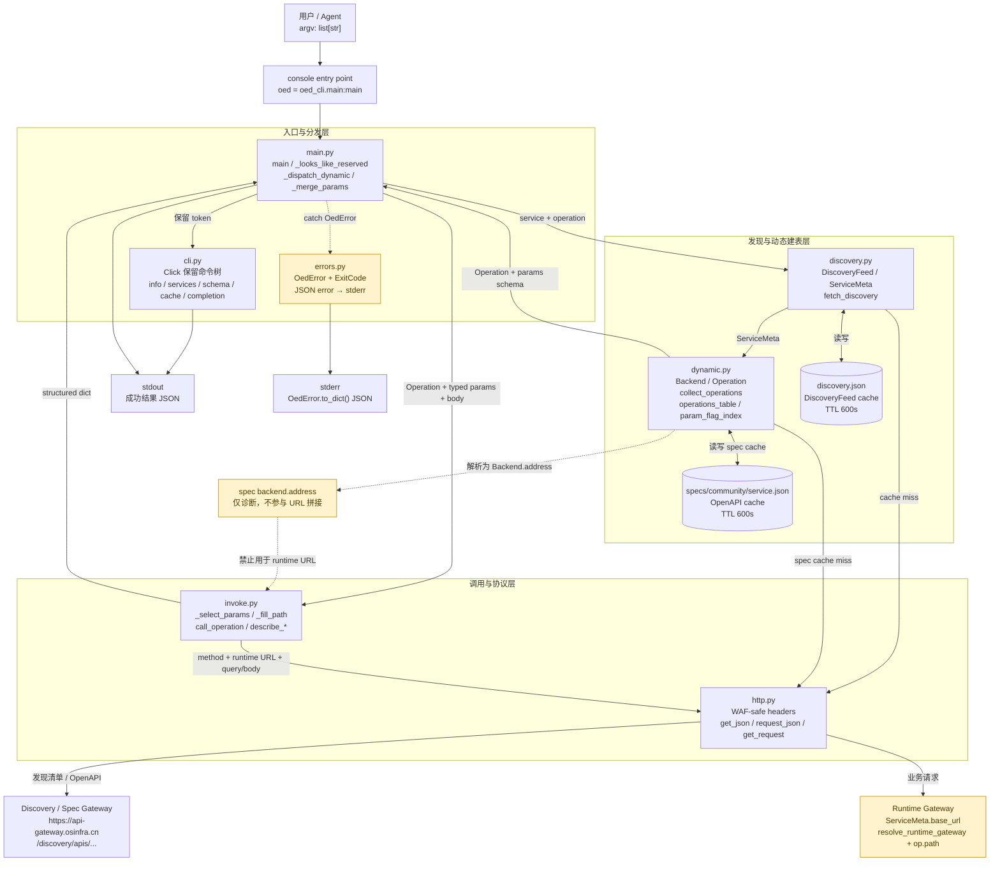
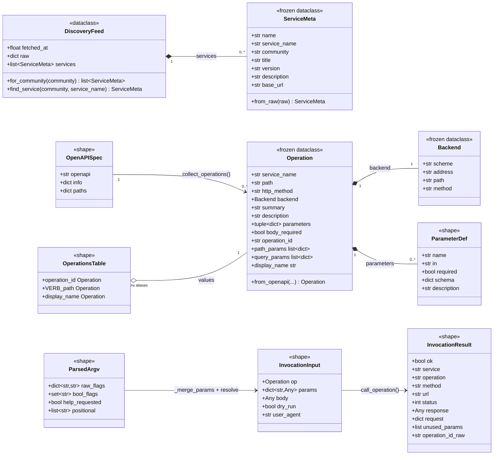
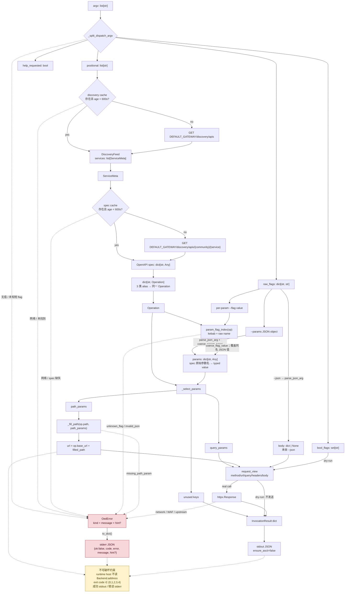

# 动态命令构建模块架构说明

> `oed` 之所以能从「写死的 click 子命令」升级为「网关侧任意服务即插即用」，
> 全靠这一层：`discovery.py` 拉清单 → `dynamic.py` 编表 → `main.py` 分发 →
> `invoke.py` 真正发请求。
> 本文逐层拆解这条流水线的实际代码（截至 `zwj_dev` 分支），并标出所有
> 「不可破坏的约束」—— 任何改动都要先回答：这条约束还能成立吗？

设计日期：2026-07-28

---

## 1. 模块在整体中的位置



图中刻意拆开了两个网关：

| 网关 | 常量 / 来源 | 用途 |
|---|---|---|
| `https://api-gateway.osinfra.cn` | `http.py:DEFAULT_GATEWAY` | 获取 discovery feed 和单服务 OpenAPI spec |
| `(per-service)` | `resolve_runtime_gateway(service)` | 执行业务 operation；拼接 `op.path`，host 来自 discovery feed 的 `ServiceMeta.base_url` |

`dynamic.py` 与 `main.py` 中的 `_dispatch_dynamic` 路径共同构成「动态命令构建」的完整链路：
- `dynamic.py` 负责**模型 + 表**（纯函数、无 I/O 调用）。
- `main.py:_dispatch_dynamic` 负责**运行时入口**（吃 argv → 喂动态表 → 喂 invoke）。
- `invoke.py` 负责**真正发请求**（吃 Operation → URL/headers/body → 输出 JSON）。

---

## 2. 端到端调用链

下面这条链路过一遍就理解了。`oed software-package-server listSoftwarePackages --phase accepted --page-num 1 --count-per-page 5` 实际发生的事：

```mermaid
sequenceDiagram
    autonumber
    actor U as User / Agent
    participant M as main.py
    participant D as dynamic.py
    participant Disc as discovery.py
    participant Cache as Local cache
    participant H as http.py
    participant DGW as Discovery Gateway
    participant I as invoke.py
    participant RGW as Runtime Gateway

    U->>M: argv = [service, operation, --phase, accepted, ...]
    M->>M: _looks_like_reserved(argv) = false
    M->>M: _split_dispatch_argv(rest)
    Note right of M: raw_flags: dict[str, str]<br/>bool_flags: set[str]<br/>help_requested: bool<br/>positional: list[str]

    M->>D: resolve_service_by_name(service_name)
    D->>Disc: fetch_discovery(force_refresh=false)
    Disc->>Cache: read discovery.json
    alt discovery cache fresh (< 600s)
        Cache-->>Disc: DiscoveryFeed
    else missing / stale
        Disc->>H: get_json(DEFAULT_GATEWAY + /discovery/apis)
        H->>DGW: GET discovery feed
        DGW-->>H: JSON services
        H-->>Disc: dict / list
        Disc->>Disc: ServiceMeta.from_raw × N
        Disc->>Cache: best-effort write discovery.json
    end
    Disc-->>D: DiscoveryFeed
    D-->>M: ServiceMeta

    M->>D: fetch_service_spec(service)
    D->>Cache: read specs/community/service.json
    alt spec cache fresh (< 600s)
        Cache-->>D: OpenAPI spec: dict[str, Any]
    else missing / stale
        D->>H: request_json(GET, SPEC_URL_TEMPLATE)
        H->>DGW: GET /discovery/apis/community/service
        DGW-->>H: OpenAPI JSON
        H-->>D: spec dict
        D->>Cache: best-effort write {__oed_fetched_at, spec}
    end
    D-->>M: OpenAPI spec

    M->>D: collect_operations(spec, service_name)
    D->>D: paths[path][verb] → Backend + Operation
    D-->>M: list[Operation]
    M->>D: operations_table(spec, service_name)
    D-->>M: dict[str, Operation]<br/>operation_id / VERB path / display_name
    M->>D: resolve_operation(table, operation_name)
    D-->>M: Operation

    M->>M: _merge_params(op, raw_flags)
    Note right of M: --params JSON + per-param flags<br/>→ typed params: dict[str, Any]<br/>--json → body: dict | None

    M->>I: call_operation(op, params, body, dry_run, user_agent)
    I->>I: _select_params → path/query/unused
    I->>I: _fill_path(op.path, path_params)
    I->>I: url = op.base_url + filled_path

    alt dry_run = true
        I-->>M: {ok, dry_run, service, operation, method, url, request, note}
    else real request
        I->>H: get_request(method, url, query, body, user_agent)
        H->>RGW: HTTP request + WAF-safe headers
        RGW-->>H: httpx.Response
        H-->>I: raw response
        I->>I: WAF check + _render_response
        I-->>M: {ok, service, operation, method, url, status, response, ...}
    end

    alt success / upstream 4xx
        M-->>U: stdout JSON; exit 0 or 3
    else OedError at any stage
        M->>M: exc.to_dict()
        M-->>U: stderr JSON; exit exc.code (1 / 2 / 3 / 4)
    end
```

以上时序中，数据不是以松散参数一路透传，而是在每一层被收敛成稳定结构：

1. `_split_dispatch_argv` 把 token 流收敛为四元组。
2. discovery 将远端 JSON 收敛为 `DiscoveryFeed` / `ServiceMeta`。
3. dynamic 将 OpenAPI `paths` 收敛为 `list[Operation]` 和多别名查找表。
4. `_merge_params` 将字符串 flag 收敛为按 schema 强转后的 `params` 和 JSON `body`。
5. invoke 将 `httpx.Response` 收敛为 stdout 可直接序列化的结果字典。

调用 `oed software-package-server listSoftwarePackages --phase accepted --page-num 1 --count-per-page 5` 时，关键中间值如下：

```text
argv
  → raw_flags = {"phase":"accepted", "page-num":"1", "count-per-page":"5"}
  → ServiceMeta(service_name="software-package-server", community="openeuler", ...)
  → Operation(operation_id="API_listSoftwarePackages", display_name="listSoftwarePackages", ...)
  → params = {"phase":"accepted", "page_num":1, "count_per_page":5}  # 键始终采用实际 spec 原始名
  → URL = "https://apig.osinfra.cn" + op.path
  → structured result dict
```


整条链路的**关键不变量**：

| 不变量 | 出处 | 含义 |
|---|---|---|
| URL = `resolve_runtime_gateway(service) + op.path` | `dynamic.py:resolve_runtime_gateway`、`invoke.py` | spec 里 `x-apigateway-backend.httpEndpoints.address` 填的 `*.test.osinfra.cn` 会被 CloudWAF 拦截，所以 host 永远从 discovery feed 来，不读 spec 的 `address` |
| `Operation.display_name` 剥 `API_` 前缀 | `dynamic.py:166-174` | Huawei APIG 给 `software-package-server` 的 `operationId` 自动加了 `API_`，需要友好展示 |
| stdout 永远 JSON (`ensure_ascii=False`) | `main.py:300`、`errors.py:25-29` | Agent 脚本 `\| jq` 的前提 |
| 退出码 0/1/2/3/4 固定 | `errors.py:6-11` | CI 按这四个码分流，**不能**新增 |

---

## 3. 数据模型

所有「动态命令表」的可观察行为都由 discovery 和 dynamic 层的数据对象决定。下面的对象图同时画出 dataclass、本地缓存载荷，以及运行时使用的派生索引；带 `<<shape>>` 标记的类不是 Python dataclass，而是文档中对 `dict` / OpenAPI 片段的结构化表示。



### 3.0 对象从哪里来、到哪里去

```mermaid
flowchart LR
    RawDiscovery["远端 discovery JSON"]
    Feed["DiscoveryFeed<br/>fetched_at + raw + services"]
    Meta["ServiceMeta<br/>一个已注册服务"]
    RawSpec["OpenAPI spec<br/>paths[path][verb]"]
    BackendBlock["x-apigateway-backend<br/>type + httpEndpoints"]
    BackendObj["Backend<br/>scheme/address/path/method"]
    ParamDefs["tuple[ParameterDef, ...]<br/>query / path 参数声明"]
    Op["Operation<br/>可调用操作"]
    Table["dict[str, Operation]<br/>多别名表"]
    Selected["resolved Operation"]

    RawDiscovery -->|"_materialize"| Feed
    Feed -->|"services[]"| Meta
    Meta -->|"community + service_name"| RawSpec
    RawSpec -->|"collect_operations"| Op
    RawSpec --> BackendBlock -->|"_parse_backend"| BackendObj --> Op
    RawSpec -->|"parameters 原样转 tuple"| ParamDefs --> Op
    Op -->|"operations_table"| Table
    Table -->|"operation_id"| Selected
    Table -->|"VERB + path"| Selected
    Table -->|"display_name"| Selected
```



- `OperationsTable` 没有独立 class；运行时真实类型是 `dict[str, Operation]`。
- `ParameterDef` 也没有 dataclass；`Operation.parameters` 保存 OpenAPI 参数 dict 的不可变 tuple 外壳，dict 内容本身不做复制或冻结。
- `InvocationResult` 中 `status` / `response` 仅真实请求存在；`request`、`unused_params`、`operation_id_raw` 为条件字段；dry-run 则增加 `dry_run` / `note`。

### 3.1 `ServiceMeta`（`discovery.py:27-47`）

```python
@dataclass(frozen=True)
class ServiceMeta:
    name: str            # "openeuler/software-package-server"
    service_name: str    # "software-package-server"（CLI 用的短名）
    community: str       # "openeuler"
    title: str
    version: str
    description: str
    base_url: str        # discovery feed 返回的运行时网关地址（直接用作 host，无 fallback）
```

- `frozen=True` → 创建后不可改；`from_raw(raw)` 是唯一的构造路径。
- `base_url` 是 discovery feed 给每个服务的运行时网关地址（截至 2026-08-07 实测全部为真实的 `https://apig.osinfra.cn`）。运行时由 `dynamic.resolve_runtime_gateway(service)` 解析：去掉尾部 `/` 和空白后原样用作 host，**无 fallback**（见 §5）。

### 3.2 `DiscoveryFeed`（`discovery.py:49-66`）

```python
@dataclass
class DiscoveryFeed:
    fetched_at: float
    raw: dict[str, Any]
    services: list[ServiceMeta] = field(default_factory=list)

    def for_community(self, community: str) -> list[ServiceMeta]: ...
    def find_service(self, community: str, service_name: str) -> ServiceMeta: ...
```

- `fetched_at` 是 discovery 缓存 TTL 的判定依据；缓存文件中的对应键为 `__oed_fetched_at`。
- `raw` 保留远端原始 payload，`services` 是 `_materialize()` 后供动态分发查找的扁平对象列表。
- `DiscoveryFeed` 本身不是 frozen；其中的每个 `ServiceMeta` 是 frozen。

### 3.3 `Backend`（`dynamic.py:111-117`）

```python
@dataclass(frozen=True)
class Backend:
    scheme: str          # "https"（缺省）
    address: str         # 来自 spec —— 通常是测试域，仅作诊断
    path: str            # 后端相对路径，可与 op.path 不一样
    method: str          # GET/POST/...
```

- `address` **不可信**为运行时 host；存在只是为了 `describe_service` 打印一个
  `backend_declared` 字段供运维排错（`invoke.py:197-202`）。
- 缺省：scheme=`"https"`, method=`"GET"`（`dynamic.py:185-189`）。

### 3.4 `Operation`（`dynamic.py:121-174`）

```python
@dataclass(frozen=True)
class Operation:
    service_name: str
    path: str                      # OpenAPI paths 的 key（运行时 URL 用这个）
    http_method: str               # GET/POST/...
    backend: Backend               # 仅用于诊断 + invoke 选 method
    summary: str = ""
    description: str = ""
    parameters: tuple[dict, ...]   # OpenAPI 原样，未改动
    body_required: bool = False
    operation_id: str = ""         # spec 原文（含 API_ 前缀）

    @property
    def path_params(self) -> list[dict]:   # in == "path"
    @property
    def query_params(self) -> list[dict]:  # in == "query"
    @property
    def display_name(self) -> str:         # 剥 API_ 前缀
```

`operation_id` 与 `display_name` 的**分离**是 v0.2.1 引入的关键设计：

| 字段 | 值 | 用在哪儿 |
|---|---|---|
| `operation_id` | spec 原文，如 `"API_listSoftwarePackages"` | 内部表的主键、错误信息、向后兼容 |
| `display_name` | 剥前缀后，如 `"listSoftwarePackages"` | 展示、`oed <svc> <display_name>` 命令行输入、`--help` |

---

## 4. OpenAPI → Operation 转换（`dynamic.py:177-228`）

### 4.1 `_parse_backend(op_dict)` — 单 operation 的后端块解析

```
spec.paths["/v1/softwarepkg"].get["x-apigateway-backend"] =
    {"type": "HTTP",
     "httpEndpoints": {"address": "...", "scheme": "https",
                       "path": "...", "method": "GET"}}
                          │
                          ▼
                Backend(scheme, address, path, method)
```

- 块缺失或 `type != "HTTP"` 时**合成**一个 `Backend(scheme="https", address="",
  path=<OpenAPI path>, method=<OpenAPI verb>)` —— 不再返回 `None`、不再过滤掉该
  operation。后端块只是诊断信息（host 永远来自 discovery feed 的 `base_url`），
  缺它不该让命令从命令表里消失。
- 缺字段给默认值，**永远不抛异常**。网关 2026-08 重命名服务后重新发布的
  `cve` / `pkgcontrib` 等 spec 已经不带这个块了。

### 4.2 `collect_operations(spec, service_name, *, base_url="")` — 路径树遍历

```python
for path, item in spec["paths"].items():
    for verb, op in item.items():
        if verb.lower() in {"get","post","put","patch","delete","head","options"}:
            yield Operation.from_openapi(
                ..., backend=_parse_backend(op, path=path, verb=verb),
                base_url=base_url)
```

- 挑出所有 HTTP verb 下的 operation（不再按后端块过滤）；`parameters`、
  `requestBody`、`summary`、`description` 原样吃下。
- 返回 `list[Operation]`，无序。

### 4.3 `operations_table(spec, service_name)` — 多别名表

每个 `Operation` 注册**三个键**：

```
primary    = op.operation_id                                  # "API_listSoftwarePackages"
verb_path  = f"{op.http_method} {op.path}"                    # "GET /v1/softwarepkg"
stripped   = op.display_name（仅当 != primary 时注册）          # "listSoftwarePackages"
```

- `stripped` 走 `if stripped != primary and stripped not in table` 防覆盖。
- 调用方 `resolve_operation` 用大小写不敏感匹配（`dynamic.py:236-239`），所以
  `listsoftwarepackages` / `listSoftwarePackages` / `LISTSOFTWAREPACKAGES` 等价。

---

## 5. URL 构造 —— 整个模块最重要的一条约束

```python
# dynamic.py
def resolve_runtime_gateway(service: ServiceMeta) -> str:
    candidate = (service.base_url or "").strip()
    return candidate.rstrip("/")
```

```python
# invoke.py
url = f"{op.base_url}{filled_path}"   # op.base_url 来自 resolve_runtime_gateway(service)
```

```
  spec.paths["/v1/cla"]
  ServiceMeta.base_url = "https://apig.osinfra.cn"           ← discovery feed 返回
                                                                │
                                                                │ resolve_runtime_gateway
                                                                ▼
  op.base_url = "https://apig.osinfra.cn"  ← 烘焙进 Operation
                                                                │
                                                                │ invoke.py 拼 URL
                                                                ▼
  url = "https://apig.osinfra.cn" + "/v1/cla"
       = "https://apig.osinfra.cn/v1/cla"                     ← 运行时唯一真值
```

为什么不用 `x-apigateway-backend.httpEndpoints.address` 当 host？

| 场景 | `address` 内容 | 后果 |
|---|---|---|
| `software-package-server` | `software-pkg.openeuler.org` | 真实生产域；当前 discovery 的 `base_url` 与之等价，所以运行时走 `https://apig.osinfra.cn` 同样可达 |
| `cve-sa-backend` | `cvesa.test.osinfra.cn` | 测试域；CloudWAF 会拦任何 `oed/x.y.z` UA 的请求 —— 即便 `base_url` 真实可调，spec 的 `address` 也不参与 host 拼装 |
| 缺 `x-apigateway-backend` 整块 | `""` | invoke 仍能跑（`op.base_url` 来自 discovery，与 backend block 无关） |

**改动红线**：
- 不要把 `x-apigateway-backend.httpEndpoints.address` 加进 URL 拼装 —— 它仅用于推断 `method` / `scheme`。
- 不要绕过 `resolve_runtime_gateway` 自己拼 host；`Operation.base_url` 是在 `collect_operations` / `operations_table` 时一次性烘焙进去的。
- **不要**再加 fallback 常量或环境变量来覆盖 `service.base_url` —— discovery feed 是 host 的唯一来源；若 gateway 在过渡期返回空或占位符，让 HTTP 调用失败暴露问题，而不是被静默重写。

---

## 6. 每参 flag 推导（`dynamic.py:79-108`）

`to_flag(name)` 把 OpenAPI 参数名转 kebab-case CLI flag：

```
cveId           → "cve-id"
pageNum         → "page-num"
count_per_page  → "count-per-page"
id              → "id"
```

实现两行（`dynamic.py:89-91`）：先在 camelCase 边界插 `-`，再把 `_` 替成 `-`，最后 `lower()`。

`param_flag_index(op)` 把每个 `query` / `path` 参数注册**两次**：

```
declared = {
    "cve-id":  <param_def schema.integer ...>,
    "cveId":   <param_def schema.integer ...>,    # 同一份，原始名也接受
    "page-num": <param_def schema.integer ...>,
    "pageNum":  <param_def schema.integer ...>,
    ...
}
```

这让用户既能写 `oed cve-sa getNotice --cve-id CVE-2024-1234` 也能写 `--cveId CVE-2024-1234`，
两种形式都过同一份 `param_flag_index`。

### 6.1 双层类型强转

```
原始 argv
  --page-num 1                # CLI 强转：coerce_flag_value（dynamic.py:300）
      │  schema.type == "integer", "1".isdigit() → int(1)
      ▼
  params["pageNum"] = 1
  ──────────────────────────
  --params '{"page_num":"1"}'  # JSON 强转：coerce_param_types（dynamic.py:267）
      │  declared_ints ⊇ {"page_num"}，"1".lstrip("-").isdigit() → int(1)
      ▼
  params["page_num"] = 1
```

- `coerce_flag_value`：CLI flag → 单值转换；不知道 schema 时返回原字符串。
- `coerce_param_types`：JSON 字典 → 批量转换；仅在 spec 里 schema.type 声明为
  `integer` / `number` 时才动数据。

二者**配合覆盖**两种入口，且都遵循「只在 spec 显式声明时才强转」的原则，
避免误伤用户传的字符串数字（`coerce_flag_value` 里 `int("abc")` 不抛异常，直接返回 `"abc"`）。

### 6.2 参数、缓存、请求与错误的数据流



这张图中的三条汇合规则最重要：

- **缓存汇合**：命中和远端拉取最终都必须产出相同的 `DiscoveryFeed` / OpenAPI spec 形状。
- **参数汇合**：`--params` 与 per-param flags 最终都写入以 spec 原始参数名为键的 `params`；per-param flag 后写入，因此覆盖同名 JSON 值。
- **输出汇合**：正常结果只到 stdout；任何 `OedError` 都先过 `to_dict()`，只到 stderr，并使用既有退出码。

---

## 7. JSON / 参数解析容错

`parse_json_arg(blob, flag=...)`（`dynamic.py:247-264`）：

| 输入 | 行为 |
|---|---|
| `None` 或 `""` | 返回 `None`（不报错） |
| 合法 JSON object | 返回 dict |
| 合法但非 object（如 `[1]`） | `UserError(kind="invalid_json")` |
| 非法 JSON | `UserError` + 行号/列号定位 |

错误信息样例：

```json
{"ok": false, "code": 1, "error": "invalid_json",
 "message": "--params is not valid JSON: Expecting value (line 1, col 4)"}
```

`main.py:_split_dispatch_argv` 还在更早一层捕获 `--<value-flag>` 缺值的场景
（`_VALUE_FLAGS = {"params","json","path","user-agent"}`），抛
`OedError(kind="missing_flag_value")`。

---

## 8. 顶层分发（`main.py`）

### 8.1 入口分流

```python
# main.py:390
def main(argv=None):
    raw = list(argv if argv is not None else sys.argv[1:])
    if _looks_like_reserved(raw):
        click_cli.main(args=raw, standalone_mode=False)   # 走 click 子树
    else:
        return _dispatch_dynamic(raw)                     # 走动态表
```

`_looks_like_reserved`（`main.py:81-89`）认以下 token 为保留入口：
- `LEADING_FLAGS = {"-h", "--help", "-V", "--version"}`
- `RESERVED_FIRST_TOKENS = {"info","services","schema","cache","completion","help",""}`
- 任何以 `-` 开头的 token（顶层 flag）

如果首 token 不在上述集合里 → 视为 `<service>` → 进 `_dispatch_dynamic`。

### 8.2 `_dispatch_dynamic` 流水线

```
argv = ["<service>", "<method>", ...flags...]
   │
   ├─► _split_dispatch_argv           # main.py:92    第一遍：分桶
   │     raw_flags / bool_flags / help_requested / positional
   │
   ├─► resolve_service_by_name        # dynamic.py:405 (via discovery feed)
   ├─► fetch_service_spec             # dynamic.py:366 (with file cache)
   ├─► collect_operations             # dynamic.py:192
   │
   ├─► if not method:
   │     service-level listing / help # invoke.describe_service
   │     return 0
   │
   ├─► operations_table + resolve_operation
   │     # 大小写不敏感、API_ 前缀别名、VERB path 别名三路都接受
   │
   ├─► if help_requested:
   │     describe_operation_help      # invoke.py:230
   │     return 0
   │
   ├─► _merge_params                  # main.py:149
   │     --params + per-param flag 合并
   │     coerce_flag_value + coerce_param_types 双层强转
   │     未知 flag → OedError(kind="unknown_flag")
   │
   ├─► call_operation(...)            # invoke.py:90
   │     真发请求 / dry-run / WAF 检测
   │
   └─► stdout: json.dumps(result, ensure_ascii=False, indent=2)
        return 0 if result["ok"] else 3
```

### 8.3 `_split_dispatch_argv` 的分桶规则（`main.py:92-146`）

| 输入 | 归到 | 说明 |
|---|---|---|
| `--` | 结束 flag 解析，后续全部 positional | 与 POSIX 习惯一致 |
| `-h` / `--help` | `help_requested = True` | 不进 raw/bool |
| `--key=value` | key in `_BOOL_FLAGS` → bool；否则 raw | |
| `--key value` 且 key in `_VALUE_FLAGS` | raw[key]=value | `params`/`json`/`path`/`user-agent` |
| `--key value` 且下一 token 不是 `-` | raw[key]=value | candidate per-param flag |
| `--key` 单独 | bool_flags | |
| `-x`（短 flag） | `OedError(kind="unknown_flag")` | 消息仍会明确写 `unknown short flag`，但机器错误名复用统一的 `unknown_flag` |
| 其它 | positional | |

**未知 flag 不在这里拒绝**——留到 `_merge_params` 跟 `param_flag_index(op)` 对齐后再报，
这样错误消息可以带上「该 operation 实际声明了哪些 flag」。

### 8.4 `_merge_params` 的合并顺序（`main.py:149-199`）

```
1. --params JSON → params 字典
2. --json        → body（不并入 params）
3. per-param flag:
     - 跳过 _VALUE_FLAGS / _BOOL_FLAGS（已在第一遍消费）
     - 不在 declared → unknown_flag 错误 + 提示声明了哪些参数
     - 在 declared → coerce_flag_value(param_def, value) → params[原始名]
4. coerce_param_types(op, params)    # 给 --params 通道补一遍强转
```

覆盖规则：**per-param flag 覆盖 `--params` 同名字段**（这是显式约定，文档 `cli-design.md §3.3`）。

### 8.5 错误传播

任何 `OedError` 在 `_dispatch_dynamic` 都被 `try/except` 包住后：

```python
click.echo(json.dumps(exc.to_dict(), ensure_ascii=False), err=True)
return exc.code
```

`to_dict()` 形状（`errors.py:25-29`）：

```json
{"ok": false, "code": 4, "error": "service_not_found",
 "message": "service 'xxx' is not registered",
 "hint": "Available communities: ['openeuler']. Run `oed services` to list registered services."}
```

**绝对不要**在子模块自己 `print(exc)`——会双重输出。`main.py` 顶层的 `try/except OedError` 是兜底。

---

## 9. 缓存机制

### 9.1 Discovery feed（`discovery.py:140-164`）

```
~/.cache/oed-cli/discovery.json
%LOCALAPPDATA%\oed-cli\cache\discovery.json          # Windows
$OED_CACHE_DIR/...                                  # 测试/沙箱覆盖
```

- TTL = `CACHE_TTL_SECONDS = 600`（10 分钟）。
- 过期或缺失 → `fetch_discovery()` 调一次远端 → 写盘。
- `force_refresh=True` 跳过缓存（`oed cache refresh` 走的就是这条）。
- 写盘失败 `try/except OSError: pass` —— 缓存是 best-effort，崩溃不能影响主流程。

### 9.2 单服务 spec（`dynamic.py:65, 334-385`）

```
{_cache_dir}/specs/{community}/{service_name}.json
```

- 同样的 600 秒 TTL；独立于 discovery 缓存（互不影响）。
- `fetch_service_spec(service, force_refresh=False)` 复用 `discovery._cache_dir()`（lazy import）
  共享 XDG/Windows 解析逻辑。
- spec 缺失 `openapi` 字段 → `NotFoundError(kind="spec_missing")` —— **不**降级使用过期缓存。

### 9.3 不变性

| 缓存 | 谁触发 | 写盘失败时 |
|---|---|---|
| `discovery.json` | `fetch_discovery()` | 静默；下次重新拉 |
| `specs/<c>/<s>.json` | `fetch_service_spec()` | 静默；下次重新拉 |
| 内存 `OperationsTable` | `operations_table()` | 每次现算（无内存缓存） |

测试通过 monkeypatch `fetch_discovery` / `fetch_service_spec` 完全绕开 I/O
（`tests/test_dynamic.py:138-191`）。

---

## 10. 错误体系（`errors.py`）

```
                    ┌─────────────┐
                    │  OedError   │  base; code 默认 = 1
                    │  kind: str  │
                    │  hint: str  │
                    └──────┬──────┘
                           │
       ┌───────────┬───────┼───────┬───────────┐
       ▼           ▼       ▼       ▼           ▼
   UserError   NetworkError UpstreamError  NotFoundError
   code=1      code=2       code=3         code=4
```

| Code | Kind 举例 | 谁抛 |
|---|---|---|
| 1 | `invalid_json` / `unknown_flag` / `missing_flag_value` / `ambiguous_service` | `dynamic.py`、`main.py` |
| 2 | `network_error` / `waf_block` | `invoke.py`、`http.py` |
| 3 | `upstream_error`（4xx/5xx） | `main.py` 看 `result["ok"] == False` |
| 4 | `service_not_found` / `method_not_found` / `spec_not_found` / `spec_missing` | `discovery.py`、`dynamic.py` |

**改动红线**：
- 不要发明第 5、第 6 个退出码——CI 脚本按这 4 个分流。
- `kind` 必须是**机器可读**的短串；人类可读的修复建议放 `hint`。

---

## 11. 不变量 / 红线速查

| # | 不变量 | 文件:行 |
|---|---|---|
| 1 | URL = `resolve_runtime_gateway(service) + op.path`，不用 spec 的 `address` | `dynamic.py:resolve_runtime_gateway` / `invoke.py` |
| 2 | `display_name` 剥 `API_` 前缀；`operation_id` 保留原文；两者都进表 | `dynamic.py:166-174, 214-228` |
| 3 | per-param flag 走 `to_flag()`，原始名 + kebab 都注册 | `dynamic.py:79-108` |
| 4 | stdout 永远 `json.dumps(..., ensure_ascii=False, indent=2)`；stderr 承载错误 | `main.py:215, 300, 406` |
| 5 | 退出码 0/1/2/3/4 固定；不在 `errors.py` 加新码 | `errors.py:6-11` |
| 6 | 缓存 TTL = 600s；改值要同步 README | `discovery.py:21`、`dynamic.py:65` |
| 7 | `OedError.to_dict()` 是错误 JSON 的唯一形态 | `errors.py:25-29` |
| 8 | 子模块不自己 print 错误；统一交给 `main.py` 顶层 `try/except` | `main.py:394-407` |
| 9 | 未知 `--flag` 延后到 `_merge_params` 校验，错误信息带 declared 列表 | `main.py:184-193` |
| 10 | type 强转仅在 spec 显式声明 `integer`/`number`/`boolean` 时触发 | `dynamic.py:267-326` |

---

## 12. 扩展点与边界

### 12.1 加一个保留命令（如 `oed login`）

→ `cli.py`，不进 `_dispatch_dynamic`；保留命令优先级永远高于动态分发。

### 12.2 加一个全局 flag（如 `--output FILE`）

→ `main.py:_dispatch_dynamic` 第一行解析前消费；如果只对动态路径生效，
  在 `_split_dispatch_argv` 的 `LEADING_FLAGS` / `_VALUE_FLAGS` 加成员。

### 12.3 改 OpenAPI → Operation 的转换规则

→ `dynamic.py`：`collect_operations` / `operations_table` / `param_flag_index`。
  不要绕过这三个函数自己手写 spec 解析。

### 12.4 改 URL 拼接 / 输出包装

→ `invoke.py`：`_select_params`、`_fill_path`、`call_operation`、`describe_*`。
  不要在 `main.py` 里写 URL。

### 12.5 改 HTTP 客户端行为（重试、TLS、UA）

→ `http.py`。`User-Agent` 解析已经走 `OED_USER_AGENT` → `--user-agent` →
  内置默认的三级优先级（`http.py:_resolve_user_agent`，见
  `tests/test_dynamic.py:507-518`）。

### 12.6 加新错误类型

→ 先看现有四个 `UserError / NetworkError / UpstreamError / NotFoundError`
  能不能复用。真的需要新类时：
  - 复用现有 code（不要新增 5+）
  - `kind` 必须是稳定短串
  - 必带 `hint`

### 12.7 加新 OpenAPI 操作类型

→ 改 `_HTTP_VERBS`（`dynamic.py`）。`collect_operations` 不再按后端块类型过滤 ——
  `type: MOCK` / `type: FUNCTION` 以及整块缺失的 operation 都会进命令表，method 取
  OpenAPI verb。取舍理由：网关重命名服务后重新发布的 spec 大多不带 `x-apigateway-backend`，
  按块过滤会让整个服务的命令凭空消失（这正是 2026-08 `oed cve` 返回 `operations: []` 的原因）。

---

## 13. 与其它模块的契约

### 13.1 上游：`discovery.py` 必须提供

- `ServiceMeta`（必需字段：`name`, `service_name`, `community`, `title`,
  `version`, `description`, `base_url`）
- `DiscoveryFeed`（`fetched_at`, `raw`, `services`）
- `fetch_discovery(force_refresh=False) -> DiscoveryFeed`
- `current_community() -> str`
- `DEFAULT_GATEWAY` 与内部 `_cache_dir()`；`dynamic.fetch_service_spec()` 分别复用它们来构造 spec URL 和 spec 缓存路径
- `discovery.fetch_spec(service)` 是未经过 dynamic 单服务缓存的 legacy helper；动态分发主链使用的是 `dynamic.fetch_service_spec(service)`

### 13.2 下游：`invoke.py` 接收

- `Operation`（含 `service_name`, `backend`, `parameters`, `path`, `http_method`,
  `body_required`, `operation_id`，以及派生属性 `display_name`）
- `params: dict[str, Any]`（已按 OpenAPI schema 强转，键为 spec 原始参数名）
- `body: Any | None`
- `dry_run: bool`
- `user_agent: str | None`（通过 `http._resolve_user_agent` 三级 fallback）
- 真实请求返回 `dict`，固定含 `ok`, `service`, `operation`, `method`, `url`, `status`,
  `response`；按条件增加 `request`, `operation_id_raw`, `unused_params`
- dry-run 返回固定字段 `ok`, `dry_run`, `service`, `operation`, `method`, `url`, `request`,
  `note`，并可能增加 `operation_id_raw`；不含 `status` / `response`

### 13.3 上游 / 下游共有

`dynamic.to_flag()` 同时被 `dynamic.param_flag_index()` 调用（为 `_merge_params` 提供 flag 索引），
也被 `invoke.describe_operation_help()` / `_usage_*()` 调用（生成 help 和示例）。参数命名规则因此
只有一个事实来源；不要在 `main.py` 或 `invoke.py` 里另写一套 kebab-case 转换。

---

## 14. 测试矩阵（`tests/test_dynamic.py`）

| 关注点 | 测试 |
|---|---|
| spec 解析 | `test_collect_operations_parses_every_http_verb` / `test_backend_extraction` |
| JSON 解析容错 | `test_parse_json_arg_rejects_garbage` + `test_describe_helpers_and_main_dispatch` 内 |
| 类型强转 | `test_coerce_param_types_handles_string_ints` / `test_describe_helpers_and_main_dispatch` |
| 路径占位符 | `test_call_operation_url_built_with_filled_path` / `test_call_operation_missing_path_param_raises_user_error` |
| 分发错误 | `test_dispatch_unknown_service` / `test_dispatch_unknown_method` / `test_dispatch_invalid_json_flag` / `test_spec_missing_returns_exit_4` |
| 大综合 | `test_describe_helpers_and_main_dispatch` / `test_main_dispatch_comprehensive` |
| User-Agent 三级 | `test_resolve_user_agent_precedence` / `test_headers_function_uses_env` / `test_call_operation_forwards_user_agent` / `test_dispatch_user_agent_*`（4 个） |

测试套件运行 `pytest -q`，全部 offline（monkeypatch discovery + HTTP）。

---

## 15. 一句话总结

`dynamic.py` 把 OpenAPI 文档**只读地**翻译成「CLI 能调度的对象」；
`main.py:_dispatch_dynamic` 把 argv **解析地**投影到这个对象上；
`invoke.py` 把这个对象**写出去**（URL + headers + body）；
`resolve_runtime_gateway` + `display_name` + `Operation` 三件套构成不可破坏的契约。

任何修改前，请先把上面三个框图再读一遍，确认改动没有让「OedError 漏到 stdout」、
「URL 走了 `address`」、「退出码变成 5」这类红线破口出现。